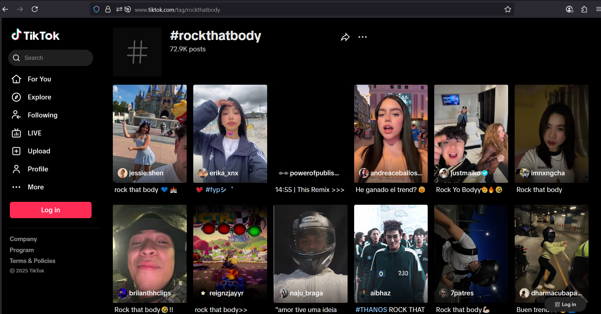
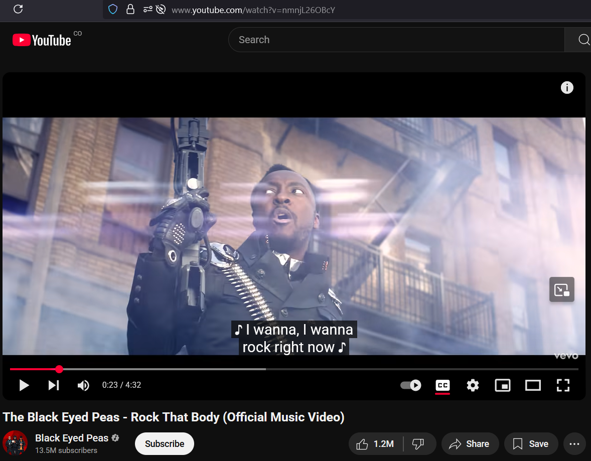
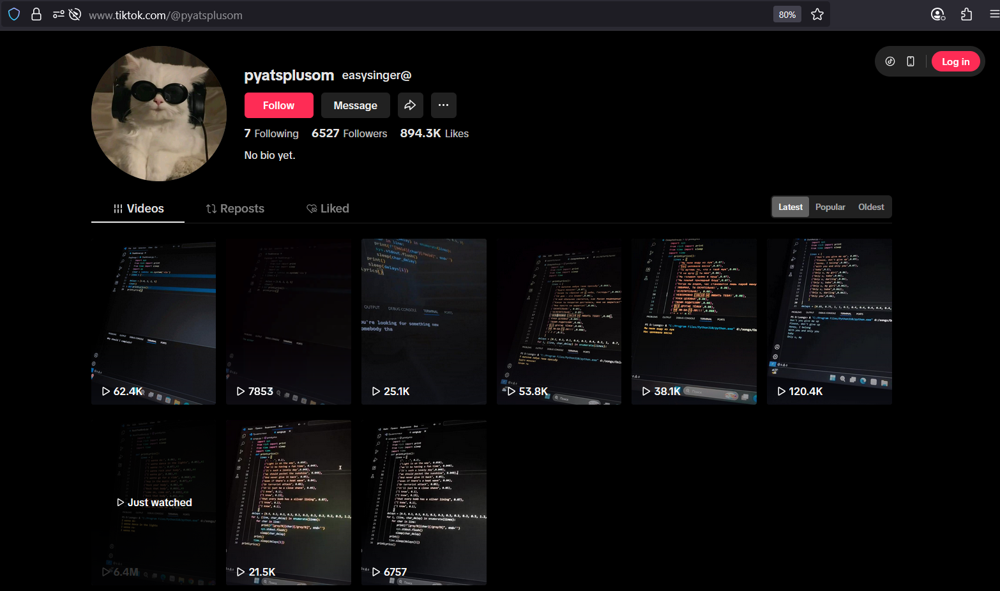
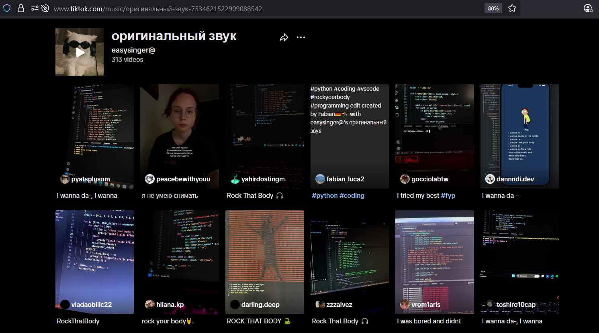

<!-- Badges:
- Source: 'https://shields.io/docs/static-badges', 'https://shields.io/badges/static-badge'.
- HTML structure followed: 'https://github.com/facebook/docusaurus/blob/main/README.md?plain=1'.
- Badges with logos: 'https://shields.io/docs/logos', 'https://simpleicons.org/', 'https://github.com/simple-icons/simple-icons/blob/master/slugs.md'.
- HTML <a> tag not redirecting: 'https://stackoverflow.com/questions/8260546/make-a-html-link-that-does-nothing-literally-nothing/8260561#8260561', 'https://www.geeksforgeeks.org/html/how-to-create-html-link-that-does-not-follow-the-link/'.
-->

<!-- Badge: WIP -->

  

<!-- Badge: Done

  

-->

<!-- README structure followed:
- 'https://www.aluracursos.com/blog/como-escribir-un-readme-increible-en-tu-github/'.
- 'https://github.com/camilafernanda/GlicoCare/'.
- 'https://github.com/nasa/openmct/'.
- 'https://github.com/facebook/docusaurus'.
-->

# Song Lyrics Typewriter.

<!-- 

  🌐 '<a href="#">[URL]</a>'

 -->

<!--
Enable autoplay of animated images:
- 'https://stackoverflow.com/questions/72508378/enable-gif-autoplay-on-github-readme/72509078#72509078'.
- 'https://github.com/orgs/community/discussions/47709'.
- 'https://github.com/settings/accessibility'.
Image width for GitHub READMEs:
- 'https://github.com/orgs/community/discussions/42424'.
- 'https://gist.github.com/uupaa/f77d2bcf4dc7a294d109'.
-->

  

<!-- Reference files or folders in project: 'https://docs.github.com/en/repositories/managing-your-repositorys-settings-and-features/customizing-your-repository/about-readmes#relative-links-and-image-paths-in-markdown-files'.
 -->

> [!NOTE]
> 🎵 You can view this gif *with audio and listen to it* for **34 seconds**, to experience at it's fullest at [`rsrcs/media/vid-readme_gif-03_compact.mp4`](rsrcs/media/vid-readme_gif-03_compact.mp4) 🤩🎵.

Personal take on recent <a href="https://www.tiktok.com/tag/rockthatbody">Tiktok's trend (as of August 2025)</a> of programming / coding in Python, that displays a song's lyrics in the console / terminal / CLI; usually the song <a href="https://www.youtube.com/watch?v=nmnjL26OBcY">'Rock that body', from The Black Eyed Peas</a> 🎶.

<!-- Have 2 columns in Markdown:
- 'https://stackoverflow.com/questions/30514408/have-two-columns-in-markdown'.
 -->

<table>
<tr>
<td>

</td>
<td>

</td>
</tr>
</table>

## Credits for Inspiration 💡.

Proper credits go to TikTok's user <a href="https://www.tiktok.com/@pyatsplusom">@pyatsplusom</a>, who seemingly initiated the <a href="https://www.tiktok.com/music/%D0%BE%D1%80%D0%B8%D0%B3%D0%B8%D0%BD%D0%B0%D0%BB%D1%8C%D0%BD%D1%8B%D0%B9-%D0%B7%D0%B2%D1%83%D0%BA-7534621522909088542">Python's coding related trend</a> with a video on August 4th, 2025 with more +6.4M views (as of August 19th, 2025): '<https://www.tiktok.com/@pyatsplusom/video/7534621487643249950>'.

<table>
<tr>
<td>

</td>
<td>

</td>
</tr>
</table>

# Code Development 👩‍💻.

**[🚧 WIP: under construction 🚧]**

# Notes on Potential New Features to Add in a Future 🆕.

List of ideas to consider for new features:

- Pull song lyrics from web portals with LRC files (e.g. '<https://www.lyricsify.com/lyrics/black-eyed-peas/rock-that-body>'), either via a provided API, or web scrapping.
- Process LRC files to create list of tuples used as input, instead of **manually** creating and saving them as CSV files; e.g. `song_lines-black_eyed_peas-rock_that_body.csv`.
- If it's available a copy of the song, locally in the computer, include launching song's playing, **coordinated in time** with the typewriter function.
    - **[Specific to devcontainers]**: since using vscode with devcontainers for code development, research how to connect a container with local's machine audio card. *Some notes available on Jupyter Notebook of version 'v250811'*: `py3-song_lyrics_terminal_console_display-v250811.ipynb`.

<!-- Embed dynamic content (image) of contributors:
- 'https://dev.to/lacolaco/introducing-contributors-img-keep-contributors-in-readme-md-gci'.
- 'https://contrib.rocks/'.
- 'https://contrib.rocks/preview?repo=a1t0ghb%2Fcourses-oracle_one-logica_programacion_II-d250726'
-->
# Contributors 🤝.

Made with [contrib.rocks](https://contrib.rocks).

<!-- Authors table structure
- From repo: 'https://github.com/camilafernanda/GlicoCare/blob/main/README.md?plain=1'.
-->
# Authors 📜.

| [ a1t0ghb](https://github.com/a1t0ghb) |
| :---: |
